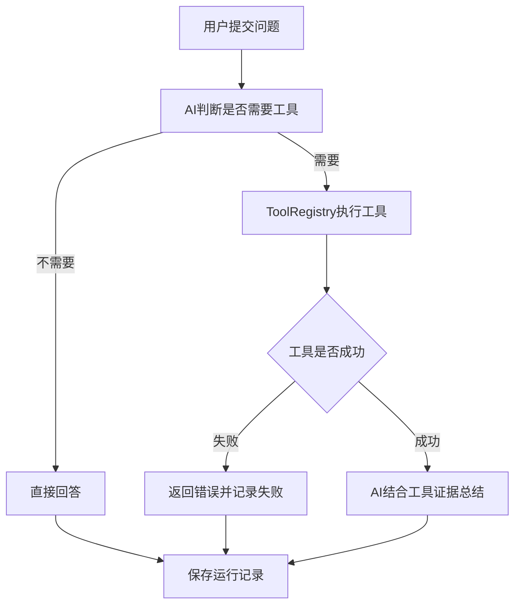

# Java 后端智能排障 Agent

基于 **Java 17、Spring Boot、DeepSeek API、MyBatis 和 MySQL** 构建的后端排障 Agent。

项目面向 Java 后端开发中的常见异常场景，由大模型判断是否需要调用工具；工具负责获取真实证据，主 Agent 再结合用户问题和工具证据生成最终排障结论。

当前重点不是堆叠大量工具，而是实现一条职责清晰、可追踪、可测试的 Agent 执行链。

---

## 一、项目目标

项目主要解决以下问题：

- SQL 字段不存在、表不存在、唯一键冲突等数据库异常；
- MyBatis 参数名不匹配、字段映射错误；
- SQL 与真实数据库表结构不一致；
- 普通 Java、Spring Boot 和接口调用异常分析；
- Agent 工具选择、执行过程和失败原因追踪。

项目定位：

> Java 后端工程能力 + 大模型应用 + Agent 工具调用与工程化治理。

---

## 二、技术栈

- Java 17
- Spring Boot 3.x
- Spring MVC
- WebClient
- MyBatis
- MySQL
- Jackson
- Lombok
- DeepSeek API
- JUnit 5
- Mockito
- Maven
- Postman

---

## 三、核心执行流程



成功调用工具时，执行步骤为：

```text
AI_DECISION
→ TOOL_EXECUTION
→ AI_SUMMARY
```

工具执行失败时，不再额外调用 AI：

```text
AI_DECISION
→ TOOL_EXECUTION（success=false）
```

---

## 四、工具设计原则

项目将“获取证据”和“分析推理”分开：

- 工具负责查询数据库、提取结构化信息等确定性操作；
- 主 Agent 负责理解问题、选择工具和生成最终回答；
- 单纯把用户原始问题再次交给另一个 AI 的类，不作为 Agent 工具；
- 与 Java 后端排障无关的工具不进入当前项目。

当前只保留两个有效工具。

### 1. `getTableSchema`

查询当前 MySQL 数据库中指定表的真实字段结构。

输入：

```json
{
  "tableName": "agent_run_log"
}
```

返回内容包括：

- 字段名；
- 字段类型；
- 是否允许为空；
- 默认值；
- 字段注释；
- 字段顺序。

当表名不存在时，可以基于编辑距离提示相似表名。

### 2. `analyzeSqlErrorWithSchema`

提取 SQL/MyBatis 报错中的结构化错误证据，并查询相关数据库表结构。

输入：

```json
{
  "log": "java.sql.SQLSyntaxErrorException: Unknown column 'theme_code' in 'field list'",
  "tableName": "agent_run_log"
}
```

工具返回：

```json
{
  "errorEvidence": {
    "errorType": "UNKNOWN_COLUMN",
    "columns": ["theme_code"]
  },
  "tableName": "agent_run_log",
  "tableSchema": []
}
```

工具本身不调用大模型。主 Agent 根据这些证据生成最终结论。

---

## 五、SQL 错误证据提取

`SqlErrorEvidenceExtractor` 使用 Java 正则表达式从日志中提取确定性证据。

当前支持：

| 错误类型          | 示例                                               |
| ----------------- | -------------------------------------------------- |
| `UNKNOWN_COLUMN`  | `Unknown column 'theme_code'`                      |
| `TABLE_NOT_FOUND` | `Table 'ai_agent.game_round_result' doesn't exist` |
| `DUPLICATE_KEY`   | `Duplicate entry '106-1' for key 'uk_match_round'` |
| `DATA_TOO_LONG`   | `Data too long for column 'camp_goal'`             |
| `SQL_SYNTAX`      | `You have an error in your SQL syntax near ...`    |
| `PARAM_NOT_FOUND` | `Parameter 'tool' not found`                       |
| `UNKNOWN`         | 未匹配到明确错误类型                               |

提取结果可包含：

- 字段名；
- 表名；
- 唯一键；
- 重复值；
- MyBatis 参数名；
- SQL 出错附近片段；
- 初步排查建议。

---

## 六、工具注册与执行

所有工具实现统一接口：

```java
public interface AgentTool {
    String name();

    String description();

    String parameterSchema();

    String execute(Map<String, Object> arguments);
}
```

`ToolRegistry` 通过 Spring 自动注入 `List<AgentTool>`，并按工具名称完成注册。

主要职责：

- 检查工具名称是否重复；
- 向大模型提供工具名称、描述和参数格式；
- 根据 AI 返回的 `toolName` 查找工具；
- 统一执行工具；
- 记录工具耗时；
- 将未知工具和执行异常封装为 `ToolExecutionResult`。

工具参数非法时抛出 `IllegalArgumentException`，由 `ToolRegistry` 统一转换为：

```json
{
  "success": false,
  "result": "工具执行失败：参数错误",
  "errorMessage": "参数错误"
}
```

---

## 七、链路追踪与日志记录

每次调用 `/agent/ask` 都会生成 `traceId`，用于串联完整执行过程。

### 1. 主运行记录

表：`agent_run_log`

记录：

- 用户原始问题；
- 最终回答；
- 是否使用工具；
- 工具名称和结果；
- AI 决策耗时；
- 工具执行耗时；
- AI 总结耗时；
- Agent 总耗时；
- 最终成功状态；
- 错误信息。

### 2. 步骤记录

表：`agent_step_log`

记录每个步骤的：

- 步骤名称和顺序；
- 输入和输出；
- 是否成功；
- 执行耗时；
- 错误信息。

只要任意步骤失败，主运行记录就保存为：

```text
success = 0
errorMessage = 第一个失败步骤的错误信息
```

---

## 八、接口说明

### 1. Agent 问答

```http
POST /agent/ask
```

请求示例：

```json
{
  "message": "帮我分析这个报错：Unknown column 'theme_code'，相关表是 agent_run_log"
}
```

### 2. 查询可用工具

```http
GET /agent/tools
```

### 3. 分页查询运行记录

```http
GET /agent/runs?pageNum=1&pageSize=10
```

支持：

- `toolName`；
- `success`；
- `startTime`；
- `endTime`。

### 4. 查询运行详情

```http
GET /agent/runs/{traceId}
```

### 5. 查询运行统计

```http
GET /agent/runs/stats
```

### 6. 普通 AI 问答

```http
POST /ai/chat
```

### 7. Java 错误结构化分析

```http
POST /ai/analyze-error
```

查看大模型原始返回：

```http
POST /ai/analyze-error/raw
```

---

## 九、异常与安全处理

当前已经实现：

- 请求参数基础校验；
- 全局异常处理；
- 统一 `Result<T>` 返回结构；
- 工具名称白名单；
- 数据库表名格式校验；
- SQL 元数据查询使用参数绑定；
- 工具失败后停止 AI 总结；
- 工具失败状态和错误信息落库；
- Prompt 限制模型编造字段类型和高风险 DDL。

表名当前只允许：

```text
字母、数字、下划线
```

校验表达式：

```regex
^[a-zA-Z0-9_]+$
```

---

## 十、单元测试

当前核心测试共 12 个。

### `SqlErrorEvidenceExtractorTest`：7个

- Unknown Column；
- Table Not Found；
- Duplicate Key；
- Data Too Long；
- SQL Syntax；
- Parameter Not Found；
- Unknown 降级。

### `ToolRegistryTest`：3个

- 正常工具执行；
- 未知工具；
- 工具抛出异常。

### `AgentLogServiceTest`：2个

- 任意步骤失败时保存失败主记录；
- 所有步骤成功时保存成功主记录。

测试使用：

- JUnit 5；
- Mockito；
- `verify()`；
- `ArgumentCaptor`。

核心单元测试不启动 Spring、不连接 MySQL、不调用 DeepSeek。

运行测试：

```bash
./mvnw test
```

Windows：

```bat
mvnw.cmd test
```

---

## 十一、项目结构

```text
src/main/java/com/example/agent
├── common          统一返回结构
├── config          DeepSeek、WebClient配置
├── controller      Agent和AI接口
├── dto             请求、响应和执行结果
├── entity          运行记录和步骤记录
├── exception       业务异常与全局异常处理
├── mapper          MyBatis Mapper接口
├── service         Agent编排、AI调用、日志服务
├── sql             SQL错误证据与提取器
└── tool            工具接口、注册中心和有效工具

src/main/resources
├── mapper          MyBatis XML
└── application.yml

src/test/java/com/example/agent
├── service         日志服务测试
├── sql             SQL证据提取测试
└── tool            工具注册中心测试
```

---

## 十二、本地运行

### 1. 环境要求

- JDK 17；
- Maven 3.8+，或直接使用项目自带 Maven Wrapper；
- MySQL 8.x；
- 有效的大模型 API Key。

### 2. 创建数据库

```sql
CREATE DATABASE ai_agent
    DEFAULT CHARACTER SET utf8mb4
    COLLATE utf8mb4_unicode_ci;
```

项目运行需要：

```text
agent_run_log
agent_step_log
```

两张日志表。建表脚本应以项目实际 SQL 文件为准。

### 3. 配置环境变量

禁止在 `application.yml` 中提交真实密码和 API Key。

```yaml
spring:
  datasource:
    password: ${SQL_PASSWORD}

deepseek:
  api-key: ${DEEPSEEK_API_KEY}
```

需要设置：

```text
SQL_PASSWORD
DEEPSEEK_API_KEY
```

如果密钥曾经进入 Git 历史，应在服务商后台作废旧密钥并重新生成。

### 4. 启动项目

Windows：

```bat
mvnw.cmd spring-boot:run
```

Linux/macOS：

```bash
./mvnw spring-boot:run
```

默认端口：

```text
8088
```

---

## 十三、当前边界

当前版本仍然是手写 Agent 第一阶段：

- 一次请求最多执行一个工具；
- 尚未实现多步工具循环；
- 尚未实现最大步骤和重复调用停止条件；
- 尚未接入 RAG；
- 尚未提供前端页面；
- 尚未接入 Spring AI。

这些属于后续里程碑，不在当前阶段提前实现。

---

## 十四、后续计划

1. 校验大模型返回的 `ToolDecision`；
2. 增加最大步骤、重复工具调用和总超时停止条件；
3. 建立固定排障案例和自动评测；
4. 完善运行状态、Prompt版本和Token记录；
5. 使用稳定版 Spring AI 重构 Tool Calling；
6. 增加 RAG 故障知识检索；
7. 借鉴实际算法接口经验，实现异步复杂诊断；
8. 增加 Vue 演示页面和 Docker 部署。

后续不为展示技术数量而增加天气、新闻、计算器、SQL生成等无关工具。

---

## 十五、项目亮点

- 手写实现 Agent 决策、工具注册、执行和结果回填流程；
- 工具只负责获取真实证据，避免工具内部重复调用 AI；
- Java 正则提取 SQL/MyBatis 结构化错误证据；
- 结合 `information_schema` 校验真实数据库表结构；
- 统一记录决策、工具和总结三阶段耗时；
- 工具失败后停止无意义的大模型调用；
- 主记录和步骤记录支持追踪、筛选和统计；
- 使用 JUnit 5、Mockito 和 ArgumentCaptor 覆盖核心逻辑；
- 对数据库表名、敏感配置和高风险 DDL 进行安全约束。

