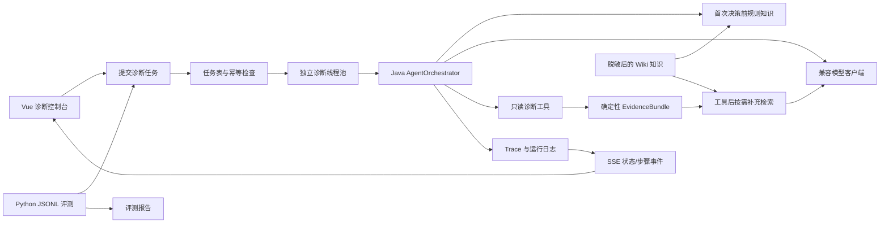

# ai-agent-demo 项目总纲

> 文档职责：本文件是项目定位、架构边界和 M0～M8 长期路线的唯一权威来源。  
> 当前真实进度、最近测试结果和新对话接手入口见 [CURRENT-STATUS.md](CURRENT-STATUS.md)。  
> 制定日期：2026-08-02。

## 1. 状态口径

本文严格使用以下状态，规划功能不得提前写成已完成：

- **已完成**：当前代码已实现，并至少有代码审计或自动测试依据。
- **当前进行中**：已经开始，但尚未满足阶段验收标准。
- **后续计划**：职业主线所需，按里程碑顺序实施。
- **有条件再做**：只有前置数据、评测或规模条件成立后才实施。
- **暂不开发**：当前投入产出比低、偏离项目定位或会造成无必要复杂度。

README 中旧有的“M1：Agent 编排闭环”和“M2：接口结构与工具诊断增强”是历史迭代名称。本文从 2026-08-02 重新建立 M0～M8 长期路线；两套编号不表示同一阶段，也不应混用。

## 2. 项目定位

ai-agent-demo 是个人学习和求职项目，长期定位为：

> **面向 Java 后端故障诊断的异步、证据驱动、可观测 AI Agent 应用。**

SQL/MyBatis 排障是第一个核心场景。项目重点不是覆盖所有故障类型，而是用可运行代码、自动测试、评测报告和演示界面证明以下能力：

- Java Agent 编排与受控工具调用；
- 确定性工具证据与模型回答约束；
- RAG 知识辅助和检索效果评测；
- 长耗时诊断任务的异步执行、并发隔离、状态机、超时和恢复；
- Trace、运行日志、指标和失败复盘；
- Python 批量评测与知识处理；
- Vue 轻量演示控制台和 SSE 实时进度；
- Docker Compose、CI 和服务器部署；
- 可用于简历、作品集和面试讲解的工程证据。

目标岗位：

- Java 后端开发工程师（AI 应用方向）；
- AI Agent 应用开发工程师；
- 大模型应用后端工程师；
- 企业智能化平台后端工程师。

项目不以算法研究、预训练、深度学习研究或纯模型训练岗位为目标。

## 3. 目标用户与核心问题

目标用户是 Java 后端研发、内部技术支持和需要复盘故障诊断过程的研发团队。

第一阶段解决：

- SQL 字段、表结构和运行环境不一致；
- MyBatis 参数、字段映射和 Mapper 配置问题；
- 常见 MySQL 错误的证据提取与排查建议；
- Agent 为什么调用工具、使用了什么证据、在哪一步失败；
- 长耗时诊断任务如何提交、执行、查询、恢复和实时查看进度。

项目的核心问题不是“让模型回答更多”，而是：

> 当故障结论依赖真实系统信息时，如何让模型调用受控工具，以确定性证据为最高优先级生成回答，并让整个过程可测试、可评测、可追踪、可恢复。

## 4. 架构边界

### 4.1 个人项目与工作经验边界

本项目可以借鉴通用的长耗时任务工程模式，但不得复制或影射工作项目中的代码、接口、数据结构、业务名称、流程、文档或敏感信息。

允许抽象复用的通用概念仅包括：

- 长耗时诊断任务；
- 异步执行；
- 任务状态机；
- 独立线程池和并发隔离；
- 超时、有限重试和失败恢复；
- 幂等键和重复执行拦截；
- SSE/WebSocket 状态通知。

所有代码、示例数据、状态名称、接口和演示内容都必须围绕公开的 Java 后端故障诊断场景重新设计。项目文档和面试表述中不得出现工作项目名称或业务叙事。

### 4.2 功能边界

项目保留：

- 一次诊断任务内的多步模型决策和工具执行；
- 少量高质量、只读、可验证的诊断工具；
- SQL/MyBatis 垂直知识；
- 异步任务、Trace、评测和演示闭环；
- DeepSeek/OpenAI 兼容接口以及可选的本地模型接入。

项目不执行自动 DDL、`UPDATE`、`DELETE`，不直接修复业务数据库，不构建通用聊天平台。

### 4.3 技术选择原则

- Java/Spring Boot 始终是主后端，不用 Python 重写 Agent。
- 不为了“像生产系统”而预先拆微服务、引入消息队列或多 Agent。
- 先建立规则检索基线，再用评测决定是否引入向量检索。
- 新框架必须解决已被测试或数据证明的问题。
- 每个里程碑都必须可执行、可测试、可演示、可提交。

## 5. 各项技术职责

### 5.1 Java / Spring Boot

- Agent 主后端和 API；
- 模型决策与工具编排；
- 工具注册、参数校验、执行和证据结构化；
- 异步诊断任务、状态机、线程池和并发隔离；
- 超时、重试、幂等、恢复和持久化；
- Trace、运行查询、指标和 SSE 事件输出。

### 5.2 Python

- 批量执行 JSONL 评测集；
- 汇总工具选择、参数、证据、回答质量和耗时指标；
- 生成 JSON/Markdown 评测报告；
- 后续处理已筛选 Wiki 文档的清洗、分块和向量生成；
- 不承载在线 Agent 主链路。

### 5.3 Vue

- 提交故障诊断任务；
- 展示排队、运行、成功、失败和超时状态；
- 通过 SSE 实时显示 Agent 步骤；
- 展示工具证据、知识来源、最终结论和耗时；
- 查询历史运行记录；
- 不建设复杂通用管理后台。

### 5.4 个人 Wiki

- Wiki 本体继续服务个人学习沉淀；
- 只有经过知识清单选择、确认允许公开并完成脱敏的 Markdown 才能成为 Agent 知识源；
- 不直接扫描或导入整个 Wiki 目录；
- 每次导入记录来源标识、内容哈希、知识版本和处理结果；
- 原始私人文档、工作资料、账号、内部地址和敏感数据不得进入仓库或评测集。

### 5.5 向量库

- 少量文档阶段继续使用 `SimpleRagRetriever` 的规则检索；
- 先建立固定评测集、规则基线和失败样例；
- 当公开知识达到可观规模，且规则检索召回率或维护成本出现可量化问题时，再实验向量或混合检索；
- 是否保留向量库由 M6 评测结果决定，不因技术流行而默认引入。

### 5.6 部署

- 先完成本地 Docker Compose 可复现启动；
- 再完成全栈 Compose、健康检查、日志、监控和 CI；
- 最后部署到个人服务器并形成演示脚本；
- 密钥、数据库密码、服务器地址和私人 Wiki 路径不得提交到 Git。

## 6. 当前代码基线

截至 2026-08-02，代码已经具备：

- `AgentController` 的 `/agent/ask`、工具列表、运行分页、统计和详情接口；
- `SimpleAgentService` 创建 `traceId`、调用编排器并保存运行日志；
- `AgentOrchestrator` 的“AI 决策 → 工具执行 → 工具后知识检索 → 结果回填 → 再次决策”同步循环；
- `DeepSeekDecisionClient` 的工具提示、JSON 决策解析、单次模型超时和证据回填；
- `AgentTool`、`ToolRegistry`、`GetTableSchemaTool`、`AnalyzeSqlErrorWithSchemaTool`；
- 最大 3 次工具调用、总执行时间检查和重复工具调用拦截；
- `SimpleRagRetriever` 对 5 类 SQL 主题的固定关键词检索；
- `AgentLogService` 对主运行、步骤、分页、详情和统计的保存/查询；
- 30 个当前通过的自动测试。

当前尚未实现首次 AI 决策前知识注入。现有 `AgentOrchestrator` 只有在工具成功后才调用 `retrieveKnowledge`，因此 M0 是当前唯一开发入口。

## 7. 当前链路与目标链路

### 7.1 当前同步链路

```text
POST /agent/ask
  → SimpleAgentService 生成 traceId
  → AgentOrchestrator 创建消息上下文
  → DeepSeekDecisionClient 首次决策
  → 无需工具：直接回答
  → 需要工具：保护检查 → ToolRegistry 执行
  → 工具成功后 SimpleRagRetriever 检索
  → 工具证据 + 知识回填模型
  → 再次决策/总结
  → AgentLogService 保存主记录和步骤
  → 同步返回结果
```

### 7.2 目标异步链路



目标链路要求工具证据优先于 RAG，RAG 优先于模型通用推测。任务失败、超时和恢复也必须形成 Trace，而不能只留下后端异常日志。

## 8. 模块职责

### 8.1 当前模块

| 模块/类 | 当前职责 |
|---|---|
| `AgentController` | 同步问答、工具列表、运行记录与统计查询 |
| `SimpleAgentService` | 创建 trace、调用编排器、触发日志保存 |
| `AgentOrchestrator` | 请求内多步决策、工具执行、RAG 和保护 |
| `DeepSeekDecisionClient` | 模型调用、提示词、决策解析、证据回填 |
| `ToolDecisionValidator` | `ToolDecision` 基础字段校验和归一化 |
| `AgentTool` / `ToolRegistry` | 工具定义、注册、查找、统一执行与计时 |
| `SqlErrorEvidenceExtractor` | 从日志中确定性提取 SQL 错误证据 |
| `SimpleRagRetriever` | 固定关键词到本地 Markdown 的规则检索 |
| `AgentLogService` | 主运行与步骤保存、分页、详情和统计 |

### 8.2 规划模块

规划阶段优先通过包和职责拆分，不默认拆成多个服务：

- `task`：异步诊断任务、状态机、幂等和恢复；
- `model`：供应商无关模型接口、错误分类和 usage；
- `tool`：机器可校验工具契约、授权和统一结果；
- `knowledge`：知识清单、导入、版本、规则/向量/混合检索；
- `trace`：步骤事件、SSE、指标、脱敏和查询；
- `evaluation`：Java 评测入口和 Python 批量执行/报告；
- `web`：Vue 轻量控制台。

## 9. 阶段路线总览

| 阶段 | 状态 | 核心结果 | 建议里程碑 |
|---|---|---|---|
| M0 | 当前进行中 | 修正首次决策前检索和工具后按需补充检索 | `v0.3.0-rag-closeout` |
| M1 | 后续计划 | 数据库迁移、Compose MySQL、Testcontainers、可复现运行 | `v0.4.0-reproducible` |
| M2 | 后续计划 | 工具契约、失败语义、事务、Python 自动评测 | `v0.5.0-contract-eval` |
| M3 | 后续计划 | 异步任务、状态机、线程池、超时、重试和恢复 | `v0.6.0-async-task` |
| M4 | 后续计划 | Vue 演示控制台和 SSE 实时进度 | `v0.7.0-demo-console` |
| M5 | 后续计划 | Wiki 筛选、脱敏、导入、分块和版本 | `v0.8.0-wiki-pipeline` |
| M6 | 有条件再做 | 向量/混合检索与规则基线对比 | `v0.9.0-retrieval-benchmark` |
| M7 | 后续计划 | 全栈 Compose、监控、CI 和服务器上线 | `v0.10.0-deployable` |
| M8 | 后续计划 | README、架构图、演示、简历和面试材料 | `v1.0.0-portfolio-ready` |

按工作日约 1 小时、周末约 3～5 小时估算，每周按 8～12 小时规划。M6 是否实施不影响 M7、M8；如果规则检索指标足够，应记录“不引入向量库”的评测结论并跳过 M6 实现。

## 10. M0：RAG 调用时机修正和阶段收尾

**阶段目标**

让知识在首次 AI 决策前即可参与判断，并在工具产生新证据后按需补充检索；避免同一知识重复注入和无意义增加上下文。

**为什么现在做**

当前 `SimpleRagRetriever` 已支持 5 类规则和工具结果参与查询，但 `AgentOrchestrator` 仍只在工具成功后检索。先收束这条链路，才能为后续评测建立稳定基线。

**具体任务**

- 首次模型决策前使用原始问题检索知识；
- 为 `DeepSeekDecisionClient` 增加明确的初始知识注入入口；
- 工具执行后仅在初次未命中、错误类型变化或工具结果补充了新证据时再次检索；
- 记录 `PRE_DECISION` 与 `POST_TOOL` 检索阶段、来源、命中和耗时；
- 防止同一来源和同一版本重复注入；
- 检索失败时降级继续决策，不覆盖工具证据；
- 将知识文件改为不依赖进程工作目录的可靠加载方式；
- 更新 README 中当前链路和 RAG 状态。

**涉及模块**

- `AgentOrchestrator`；
- `DeepSeekDecisionClient`；
- `SimpleRagRetriever`、`KnowledgeSearchResult`；
- `AgentTraceStep`；
- `AgentOrchestratorTest`、`SimpleRagRetrieverTest`；
- README 与状态文档。

**学习重点**

- RAG 注入时机；
- 上下文去重与证据优先级；
- 失败降级；
- 可观测步骤设计。

**测试要求**

- 首次检索命中后再执行第一次模型决策；
- 首次未命中时正常决策；
- 无需工具的回答也可使用首次知识；
- 工具结果带来新线索时触发补充检索；
- 同一知识不重复注入；
- 检索异常不阻断主链路；
- 现有重复调用和最大调用次数测试继续通过。

**可验证验收标准**

- 测试能验证调用顺序，而不只验证方法最终被调用；
- Trace 能区分首次检索与工具后检索；
- 一次典型 Unknown column 请求中知识最多注入一次，除非工具证据改变了检索结果；
- 从打包产物或非仓库根目录启动时仍能读取知识；
- `mvn test` 全部通过。

**求职展示价值**

可讲清“为什么在决策前和工具后采用不同检索策略”，体现对 Agent 上下文、证据优先级和成本控制的理解。

**预计学习时间**

6～10 小时，约 1 周。

**建议 Git 里程碑**

`v0.3.0-rag-closeout`。

## 11. M1：可复现运行和数据库集成测试

**阶段目标**

让一台新机器可以按文档启动 MySQL、执行迁移、运行测试并启动后端，不依赖开发者手工建表或已有本地数据。

**为什么现在做**

代码依赖 `agent_run_log`、`agent_step_log` 和 `information_schema`，但仓库没有建表迁移、Compose 或真实 MySQL 集成测试。异步任务开发前必须先建立可靠数据库基线。

**具体任务**

- 引入 Flyway 并创建版本化迁移；
- 为运行表和步骤表补充主键、唯一约束和查询索引；
- 提供仅包含 MySQL 的本地 Docker Compose；
- 增加 `.env.example`，不提交真实密钥；
- 重新生成并验证 Maven Wrapper；
- 使用 Testcontainers MySQL 验证 Mapper 和两个只读工具；
- 区分本地、测试和部署配置；
- 编写从空环境启动与测试说明。

**涉及模块**

- `pom.xml`、Maven Wrapper；
- `application.yml`、测试配置；
- Flyway migration；
- `AgentRunLogMapper`、`AgentStepLogMapper`；
- `GetTableSchemaTool`、`AnalyzeSqlErrorWithSchemaTool`；
- Docker Compose 和 README。

**学习重点**

- 数据库版本迁移；
- Testcontainers 生命周期；
- MySQL 集成测试；
- 配置和密钥隔离。

**测试要求**

- 空库自动迁移；
- 主记录、步骤记录、分页、详情和统计查询；
- 真实 `information_schema` 表结构查询；
- 表不存在和非法表名；
- 测试间数据隔离。

**可验证验收标准**

- 新环境 15 分钟内按文档启动；
- `mvnw test` 可运行；
- 集成测试不依赖开发者本地 MySQL；
- 数据库结构只由迁移管理；
- 所有测试通过。

**求职展示价值**

证明数据库迁移、容器化依赖、真实集成测试和可交付性，而不只是本机 Demo。

**预计学习时间**

16～24 小时，约 2～3 周。

**建议 Git 里程碑**

`v0.4.0-reproducible`。

## 12. M2：工具契约、失败语义、事务和 Python 自动评测

**阶段目标**

把工具调用从“模型遵守提示词”升级为“系统强制执行契约”，并用 Python 评测建立第一条可量化质量基线。

**为什么现在做**

当前 `AgentTool.parameterSchema()` 只是字符串，`ToolDecisionValidator` 不校验工具是否存在、必填参数和类型；日志保存没有事务；项目也无法量化工具选择和回答质量。

**具体任务**

- 定义机器可校验的工具参数契约；
- 校验工具名、必填参数、类型、长度和允许值；
- 统一 `ToolExecutionResult` 的成功、参数错误、未找到、超时和系统异常语义；
- 表不存在等业务失败不得伪装成工具成功；
- 将最大工具次数改为配置；
- 对主运行和步骤保存增加事务与失败策略；
- 明确 HTTP 状态和 Agent 运行状态；
- 建立 JSONL 评测集；
- 使用 Python 批量调用评测入口，生成 JSON 和 Markdown 报告；
- 记录 Prompt、模型和知识版本，保证结果可比较。

**涉及模块**

- `AgentTool`、`ToolRegistry`、两个现有工具；
- `ToolDecisionValidator`、`AgentOrchestrator`；
- `AgentLogService`、Mapper 和 Controller；
- `evaluation/` 下的 Python 脚本、JSONL 数据和报告模板。

**学习重点**

- 工具 Schema 和运行时校验；
- 错误分类与 API 语义；
- Spring 事务；
- Agent 评测指标和可重复实验。

**测试要求**

- 未知工具、缺参、错类型、超长参数和多余参数；
- 工具业务失败、系统异常和模型格式异常；
- 主记录/步骤写入失败时回滚；
- 至少 40～60 条评测案例；
- 固定 Stub 模型模式和可选真实模型模式。

**可验证验收标准**

- 模型无法绕过系统工具参数校验；
- 所有失败有稳定错误码和状态；
- 日志不会部分写入；
- 报告至少给出是否调用工具准确率、工具名准确率、参数完整率、证据覆盖率、无依据回答率、模型调用次数和耗时；
- 规则 RAG 开启/关闭有同一数据集基线对比。

**求职展示价值**

体现 Agent 工具治理、事务一致性和评测能力，是区别于普通聊天项目的关键里程碑。

**预计学习时间**

24～36 小时，约 3～4 周。

**建议 Git 里程碑**

`v0.5.0-contract-eval`。

## 13. M3：异步诊断任务和失败恢复

**阶段目标**

将同步 `/agent/ask` 演进为可提交、可查询、可恢复的长耗时诊断任务，并实现请求线程与诊断执行的并发隔离。

**为什么现在做**

只有在同步链路、数据库和失败语义稳定后，异步化才不会放大不一致。该阶段直接对应 Java AI 应用后端对长耗时任务治理的要求。

**具体任务**

- 设计通用诊断任务表和状态机；
- 建议状态：`QUEUED`、`RUNNING`、`SUCCEEDED`、`FAILED`、`TIMED_OUT`、`CANCELLED`；
- 提供任务提交、状态、结果和取消接口；
- 使用独立 `ThreadPoolTaskExecutor`，配置核心线程、队列、拒绝策略和优雅停机；
- 引入客户端幂等键和数据库唯一约束；
- 对暂时性模型网络错误执行有限重试，不重试参数错误和确定性业务失败；
- 任务级超时与步骤级超时分离；
- 应用重启时扫描并恢复/终结过期 `RUNNING` 任务；
- 保留同步接口作为调试兼容入口，正式演示使用异步任务接口；
- 不默认引入消息队列。

**涉及模块**

- 新增 `task` 包、任务实体、Mapper/Repository、状态机和执行器；
- `AgentOrchestrator`、`SimpleAgentService`；
- `AgentController` 或独立任务 Controller；
- `AgentLogService` 和 Trace；
- 线程池和任务配置。

**学习重点**

- 状态机不变量；
- Spring 线程池和事务边界；
- 幂等、重复执行拦截；
- 超时、重试、恢复与优雅停机；
- 并发隔离。

**测试要求**

- 所有合法/非法状态迁移；
- 同一幂等键并发提交只创建一个任务；
- 队列满、任务超时、取消、模型临时错误和永久错误；
- 应用重启后的悬挂任务恢复；
- 多任务并发时 Trace 不串线；
- 线程池关闭和未完成任务处理。

**可验证验收标准**

- 提交接口快速返回任务 ID 和 `QUEUED`；
- 客户端可独立查询最终结果；
- 状态迁移可追踪且不能逆向跳转；
- 重复提交不会重复消耗模型；
- 重启后没有永久停留的 `RUNNING` 任务；
- 评测脚本可以批量提交并等待任务完成。

**求职展示价值**

证明 Java 并发、任务状态、幂等、恢复和 AI 长耗时调用治理能力，同时与任何具体工作业务保持隔离。

**预计学习时间**

28～40 小时，约 3～5 周。

**建议 Git 里程碑**

`v0.6.0-async-task`。

## 14. M4：Vue 演示控制台和 SSE 实时进度

**阶段目标**

提供一个围绕诊断任务的轻量演示界面，实时展示状态、步骤、证据和结论。

**为什么现在做**

前端必须建立在稳定异步任务和事件语义上。提前开发只会围绕临时接口返工。

**具体任务**

- Vue 单页提交故障日志和表名；
- 任务状态和历史列表；
- Spring SSE 端点和断线重连；
- 实时展示 `AI_DECISION`、`TOOL_EXECUTION`、`KNOWLEDGE_RETRIEVAL`、`AI_SUMMARY`、`AGENT_GUARD`；
- 区分工具证据、知识来源和模型结论；
- 展示各阶段耗时和最终状态；
- 页面只做求职演示所需功能，不建设通用权限/菜单后台。

**涉及模块**

- Vue 应用；
- SSE Controller、事件发布和断线恢复；
- 异步任务查询接口；
- Trace DTO 和跨域配置。

**学习重点**

- SSE 事件模型；
- Last-Event-ID/重连；
- 前后端状态一致性；
- 面向证据的 UI 信息层次。

**测试要求**

- 后端 SSE 事件顺序和任务隔离；
- 断线后状态补偿；
- 前端组件和关键交互测试；
- 任务失败、超时和取消界面；
- 至少一条端到端演示测试。

**可验证验收标准**

- 用户提交后无需阻塞页面；
- 运行步骤可实时出现；
- 刷新或短暂断线后能恢复最终状态；
- 工具证据、知识来源和模型回答在 UI 中明确分区；
- 5 分钟内可完成标准演示。

**求职展示价值**

让面试官直观看到异步 Agent、证据链和可观测性，而不是只看 Postman JSON。

**预计学习时间**

20～30 小时，约 2～4 周。

**建议 Git 里程碑**

`v0.7.0-demo-console`。

## 15. M5：Wiki 知识筛选、脱敏、导入、分块和版本管理

**阶段目标**

建立安全、可审计、可重复的个人知识导入流程，而不是直接读取整个私人 Wiki。

**为什么现在做**

只有在评测、异步执行和前端展示稳定后，扩大知识规模才有衡量收益和暴露来源的基础。

**具体任务**

- 定义显式知识清单，逐篇选择允许公开的 Markdown；
- Python 执行格式清洗、敏感模式扫描和人工确认清单；
- 保留标题、章节、来源 ID、内容哈希、版本和更新时间；
- 按 Markdown 标题与长度分块；
- 生成项目可读取的公开知识产物；
- 支持增量导入、删除和版本回滚；
- Trace 记录知识版本和块来源；
- 私人 Wiki 路径、原文和未脱敏内容不进入 Git。

**涉及模块**

- Python `knowledge_pipeline`；
- 知识 manifest、公开知识目录和元数据；
- Java knowledge loader/retriever；
- Trace 和评测数据。

**学习重点**

- 文档清洗与分块；
- 数据脱敏与发布审批；
- 内容寻址、增量导入和版本化；
- 来源可追溯性。

**测试要求**

- Markdown 解析和分块边界；
- 内容哈希和增量更新；
- 敏感词/密钥/内部地址扫描；
- 删除和版本回滚；
- 导入前后规则检索回归评测。

**可验证验收标准**

- 只有 manifest 中明确允许的文档被处理；
- 脚本发现敏感内容时默认阻断发布；
- 相同版本重复导入具备幂等性；
- 每个检索结果都能定位到公开来源和知识版本；
- 仓库不包含私人 Wiki 路径或未脱敏原文。

**求职展示价值**

体现企业知识接入中的数据边界、脱敏、版本和可追溯性，而不只是“把 Markdown 塞给模型”。

**预计学习时间**

20～30 小时，约 2～4 周。

**建议 Git 里程碑**

`v0.8.0-wiki-pipeline`。

## 16. M6：向量/混合检索与规则检索评测对比

**状态：有条件再做。**

**阶段目标**

在同一固定评测集上比较规则、向量和混合检索，只有指标收益足以覆盖复杂度时才保留新方案。

**为什么不是现在做**

当前只有少量 SQL 文档，规则匹配简单、透明、成本低。没有规模和失败数据时引入向量库无法证明价值。

**启动条件**

- 已完成 M2 评测基线和 M5 安全知识导入；
- 公开知识达到足以产生表达差异和多文档排序问题的规模；
- 规则检索的召回、维护成本或跨表述能力出现可量化不足；
- 已整理至少 30 条检索困难样例。

**具体任务**

- 冻结同一知识版本和检索评测集；
- 建立规则检索基线；
- 选择一个简单可部署的 Embedding 与向量存储候选；
- 实现向量 TopK、元数据过滤和混合融合；
- 对比召回率、MRR/TopK 命中、最终回答质量、P95 延迟、资源和维护成本；
- 记录采用或拒绝向量库的决策报告。

**涉及模块**

- Java Retriever 抽象；
- Python 向量生成和评测；
- 可选向量存储及 Compose 配置；
- Trace、评测报告和知识版本。

**学习重点**

- Embedding、分块和相似度；
- 关键词与语义召回互补；
- 混合排序；
- 基于指标的架构取舍。

**测试要求**

- 固定数据集的离线检索测试；
- 元数据过滤和知识版本隔离；
- 向量服务不可用时降级到规则检索；
- 回答质量、延迟和资源对比。

**可验证验收标准**

- 报告能够量化三种检索方案；
- 只有收益达到预先定义的阈值才进入默认链路；
- 向量服务故障不阻断基础诊断；
- 若收益不足，保留规则检索并明确记录“不引入”的理由也视为阶段完成。

**求职展示价值**

重点不是“使用了向量数据库”，而是能用评测解释何时需要、如何比较以及为什么取舍。

**预计学习时间**

24～40 小时，约 3～5 周；未满足启动条件时不投入。

**建议 Git 里程碑**

`v0.9.0-retrieval-benchmark`，或以一份“不采用向量库”的决策记录结束阶段。

## 17. M7：全栈部署、监控、CI 和服务器上线

**阶段目标**

形成后端、前端、MySQL 和可选检索依赖的一致部署方式，并在个人服务器上可靠运行。

**为什么现在做**

部署应收束已经稳定的产品形态，不应在接口、数据表和前端频繁变化时提前复杂化。

**具体任务**

- 后端和 Vue 镜像；
- 全栈 Docker Compose；
- 健康检查、依赖就绪和优雅停机；
- 结构化日志、日志轮转和 Trace 查询；
- Actuator/Micrometer 指标；
- 根据个人服务器资源选择轻量监控方案；
- CI 执行单元测试、集成测试、前端构建和镜像构建；
- 服务器 HTTPS、反向代理、备份和回滚；
- 密钥通过环境变量或服务器 secret 管理。

**涉及模块**

- Dockerfile、Compose；
- Spring Boot 健康检查与指标；
- Vue 构建和反向代理；
- CI workflow；
- 部署和运维文档。

**学习重点**

- 容器健康和启动顺序；
- CI/CD 基线；
- 指标、日志、备份和回滚；
- 最小化公网攻击面。

**测试要求**

- Compose 从空环境启动；
- 健康检查和依赖失败；
- CI 全流程；
- 服务器重启后任务恢复；
- 数据库备份与恢复演练；
- 基础并发和 P95 延迟测试。

**可验证验收标准**

- 一条命令启动完整演示环境；
- CI 在干净环境中通过；
- 服务器具备 HTTPS、健康检查、日志和备份；
- 重启后服务和异步任务状态可恢复；
- Git 中没有真实密钥。

**求职展示价值**

证明从 Java AI 功能开发到可部署、可监控、可恢复服务的完整工程能力。

**预计学习时间**

24～36 小时，约 3～4 周。

**建议 Git 里程碑**

`v0.10.0-deployable`。

## 18. M8：作品集和面试材料收束

**阶段目标**

把已经由代码、测试和数据证明的能力整理为可演示、可复述的求职作品集。

**为什么最后做**

简历和架构图必须描述真实完成内容。过早包装会导致文档与代码持续冲突。

**具体任务**

- 重写 README 的定位、快速启动和演示流程；
- 生成当前架构图、异步时序图和状态机图；
- 固化 3～5 个成功、失败和保护案例；
- 保存评测基线、改进前后对比和性能数据；
- 编写 5 分钟演示脚本；
- 编写简历项目描述的短版和长版；
- 准备技术难点、取舍、失败经验和改进方向；
- 检查所有截图、日志和知识内容已经脱敏。

**涉及模块**

- README、docs、演示数据和评测报告；
- Vue 演示页；
- 部署环境；
- 简历与面试材料目录。

**学习重点**

- 技术叙事；
- 用测试和指标支撑结论；
- 架构取舍表达；
- 敏感信息检查。

**测试要求**

- 新环境按 README 走通；
- 演示脚本重复执行；
- 所有架构图与代码核对；
- 链接、命令、截图和接口示例检查；
- 进行至少一次模拟面试复盘。

**可验证验收标准**

- 5 分钟内完成标准演示；
- README 不把计划功能写成已完成；
- 每条简历亮点都能指向代码、测试、Trace 或评测报告；
- 能清楚解释为何不使用多 Agent、消息队列或向量库，或说明引入它们的评测依据；
- 文档不含工作项目或敏感信息。

**求职展示价值**

将项目转化为可验证的 Java AI Agent 工程能力，而不是功能清单。

**预计学习时间**

12～20 小时，约 1～2 周。

**建议 Git 里程碑**

`v1.0.0-portfolio-ready`。

## 19. 测试与评测总方案

### 19.1 Java 测试分层

- 单元测试：解析、工具参数、状态迁移、保护和错误分类；
- 组件测试：模型 Stub、ToolRegistry、Retriever、任务执行器；
- 集成测试：Testcontainers MySQL、Mapper、真实工具、事务和 Controller；
- 端到端测试：异步提交、SSE、最终结果和历史查询；
- 稳定性测试：并发、超时、重试、恢复、拒绝策略和优雅停机。

### 19.2 Python 评测

JSONL 案例至少包含：

- 输入问题和可选上下文；
- 是否应调用工具；
- 期望工具和关键参数；
- 期望证据字段；
- 禁止出现的无依据结论；
- 期望知识来源或是否不应检索；
- 最大模型调用次数；
- 标签和难度。

报告指标至少包含：

- 工具需求判断准确率；
- 工具名称准确率；
- 参数完整率；
- 证据字段覆盖率；
- 无依据回答率；
- 检索 TopK 命中率；
- 平均模型调用次数；
- 成功率、P50/P95 耗时和失败分类；
- Prompt、模型、知识版本和运行时间。

真实模型评测可能受模型波动影响，因此固定 Stub 测试负责回归正确性，真实模型批量评测负责观察质量趋势，两者不能互相替代。

## 20. 可观测性与稳定性目标

最终每个任务至少关联：

- `taskId`、`traceId`、幂等键和任务状态；
- 模型供应商、模型、Prompt 版本和 usage；
- 工具名称、参数摘要、结果状态、错误分类和耗时；
- 检索阶段、策略、来源、知识版本、命中和耗时；
- Agent 总耗时、排队耗时、执行耗时和重试次数；
- 状态迁移和恢复原因。

稳定性建设顺序：

1. 明确失败语义和事务；
2. 超时和有限重试；
3. 幂等和重复执行拦截；
4. 独立线程池和并发隔离；
5. 重启恢复；
6. SSE 状态通知；
7. 指标、告警和部署恢复。

## 21. 求职展示点与技术难点

最终应由代码、测试或数据证明：

- 自研 Java Agent 编排而非简单 Chat API；
- 模型决策与确定性工具证据的优先级控制；
- 工具契约、权限边界和失败语义；
- RAG 调用时机、去重和规则/向量取舍；
- 异步任务状态机、线程池隔离、幂等和恢复；
- Trace、SSE、指标和运行复盘；
- Python 评测驱动 Prompt、工具和检索改进；
- Wiki 知识筛选、脱敏、版本和来源追溯；
- Compose、CI 和服务器部署。

面试中重点讲取舍：

- 为什么工具证据必须高于 RAG 和模型推测；
- 为什么当前规则检索比向量库更合适；
- 为什么 M3 先使用数据库任务表和线程池，而不是直接上消息队列；
- 如何保证重试不造成重复模型消耗；
- 如何处理异步状态、事务和重启恢复；
- 如何用评测而不是主观体验判断改动收益。

## 22. 有条件再做与暂不开发

### 22.1 有条件再做

- 向量或混合检索：仅在 M6 启动条件成立时；
- 本地 Ollama/vLLM：完成兼容模型抽象后作为部署补充；
- WebSocket：只有 SSE 无法满足双向交互时；
- 消息队列：只有单机线程池的容量、可靠性或横向扩展问题被数据证明时；
- 简单 Answer/Embedding 缓存：有重复请求和成本数据后。

### 22.2 暂不开发

- Python 重写 Java Agent；
- LoRA、预训练或模型训练主线；
- 多 Agent 协作平台；
- 通用聊天机器人；
- 复杂低代码工作流；
- 微服务拆分和 Kubernetes；
- 自动执行 DDL、更新或删除业务数据；
- 复杂权限/菜单管理后台；
- 未经筛选导入整个个人 Wiki；
- 无限增加 SQL 错误文档或低质量工具；
- 复制或影射任何工作项目代码、数据和业务内容。
